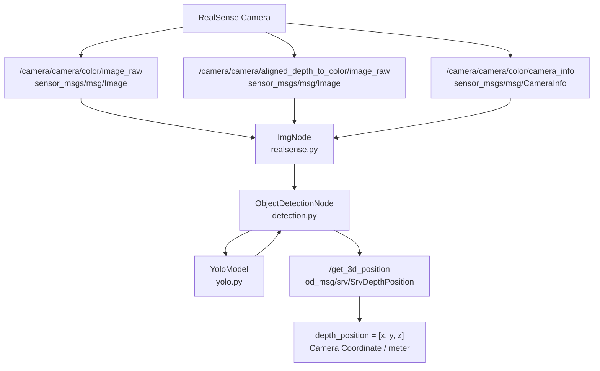

# ROS2 3D Tool Position Service

> **RealSense 깊이 카메라와 YOLOv8을 이용해 공구를 탐지하고, 카메라 좌표계 기준 3D 위치 `(x, y, z)`를 반환하는 ROS2 서비스 패키지입니다.**


---

## Overview

이 프로젝트는 **Intel RealSense D400 계열 깊이 카메라**와 **커스텀 학습 YOLOv8n 모델**을 이용해 공구를 탐지하고, 탐지된 객체의 픽셀 좌표와 깊이 정보를 결합하여 카메라 좌표계 기준 3D 위치를 계산하는 ROS2 패키지입니다.

클라이언트가 `/get_3d_position` 서비스에 공구 이름을 전달하면, 시스템은 약 1초 동안 여러 프레임을 수집한 뒤 IoU 기반 그룹화와 다수결 투표를 수행하여 탐지 결과를 집계합니다. 이후 카메라 내부 파라미터를 사용해 객체의 위치를 미터 단위 `(x, y, z)` 좌표로 반환합니다.

`T_gripper2camera.npy` hand-eye 캘리브레이션 변환 행렬이 포함되어 있으며, 로봇 팔 pick-and-place 시스템의 인지 모듈로 연동할 수 있도록 설계되었습니다.

> 현재 서비스 응답은 **카메라 좌표계 기준 위치**입니다.
> `T_gripper2camera.npy`를 이용한 로봇 좌표계 변환 및 실제 로봇 제어 연동은 별도 구현이 필요합니다.


---

## Features

* **YOLOv8 기반 공구 탐지**

  * 커스텀 학습된 `yolov8n_tools_0122.pt` 모델 사용
  * 5종 공구 지원

    * `drill`
    * `hammer`
    * `pliers`
    * `screwdriver`
    * `wrench`

* **RealSense RGB·Depth 데이터 처리**

  * RGB 이미지 구독
  * Color 프레임에 정렬된 Depth 이미지 구독
  * CameraInfo 기반 카메라 내부 파라미터 사용

* **다중 프레임 기반 탐지 안정화**

  * 약 1초 동안 탐지 프레임 수집
  * IoU 기반 탐지 결과 그룹화
  * 다수결 투표를 통한 최종 객체 결정

* **픽셀 좌표의 3D 변환**

  * 객체 중심 픽셀과 깊이값 사용
  * `fx`, `fy`, `ppx`, `ppy` 기반 카메라 좌표 계산
  * 미터 단위 `(x, y, z)` 반환

* **ROS2 커스텀 서비스 제공**

  * 서비스 이름: `/get_3d_position`
  * 서비스 타입: `od_msg/srv/SrvDepthPosition`

* **RealSense 디버그 유틸리티**

  * RGB/Depth 토픽 구독
  * 이미지 시각화 디버그 노드 제공

---

## Architecture

### 데이터 흐름



### 처리 순서

```text
서비스 요청 수신
    ↓
요청한 공구 클래스 확인
    ↓
약 1초 동안 RGB·Depth 프레임 수집
    ↓
YOLOv8 객체 탐지
    ↓
IoU 기반 탐지 결과 그룹화
    ↓
다수결 투표로 최종 탐지 결과 결정
    ↓
객체 중심 픽셀의 Depth 조회
    ↓
Camera Intrinsics를 이용한 3D 좌표 변환
    ↓
[x, y, z] 반환
```

### ROS2 서비스 흐름

```text
Service Client
    │
    │ Request
    │ target: "hammer"
    ▼
/get_3d_position
    │
    ▼
ObjectDetectionNode
    │
    ├─ YOLOv8 객체 탐지
    ├─ Depth 데이터 조회
    ├─ 다중 프레임 집계
    └─ Camera Coordinate 변환
    │
    │ Response
    ▼
depth_position: [x, y, z]
```

---

## Package Structure

### 패키지 구성

| 패키지                    | 빌드 타입          | 역할                                   |
| ---------------------- | -------------- | ------------------------------------ |
| `od_msg`               | `ament_cmake`  | 커스텀 서비스 `SrvDepthPosition.srv` 정의    |
| `object_detection`     | `ament_python` | YOLO 탐지, Depth 처리, 3D 좌표 변환 및 서비스 제공 |
| `realsense_subscriber` | `ament_python` | RGB/Depth 토픽 구독 및 시각화 디버그            |

### 디렉토리 구조

```text
ros2_ws/
└── src/
    ├── od_msg/
    │   └── srv/
    │       └── SrvDepthPosition.srv
    │
    ├── object_detection/
    │   ├── object_detection/
    │   │   ├── realsense.py
    │   │   ├── detection.py
    │   │   └── yolo.py
    │   │
    │   └── resource/
    │       ├── yolov8n_tools_0122.pt
    │       ├── class_name_tool.json
    │       └── T_gripper2camera.npy
    │
    └── realsense_subscriber/
        ├── subscribe_img
        └── subscribe_txt
```

> 실제 파일 배치와 패키지 내부 경로는 저장소 구조를 기준으로 최종 확인이 필요합니다.

---

## Prerequisites

### 운영체제 및 ROS2

| 항목       | 요구사항                               |
| -------- | ---------------------------------- |
| OS       | Ubuntu `<!-- 버전 확인 필요 -->`         |
| ROS2     | `<!-- distro 확인 필요, Humble 추정 -->` |
| 카메라      | Intel RealSense D400 계열            |
| 카메라 드라이버 | `realsense-ros`                    |
| 빌드 도구    | `colcon`                           |

### Python 의존성

* `ultralytics`
* `opencv-python`
* `numpy`
* `cv_bridge`

### ROS2 의존성

* `rclpy`
* `sensor_msgs`
* `cv_bridge`
* `ament_index_python`

> 일부 의존성이 현재 `package.xml`에 누락되어 있습니다.
> 빌드 및 실행 전에 필요한 ROS2·Python 패키지가 시스템에 설치되어 있어야 합니다.

---

## Installation & Build

### 1. 워크스페이스로 이동

```bash
cd ~/ros2_ws
```

### 2. 인터페이스 패키지 빌드

`object_detection` 패키지가 `od_msg`에 의존하므로 `od_msg`를 먼저 빌드합니다.

```bash
colcon build --symlink-install --packages-select od_msg
```

빌드 결과를 현재 터미널에 반영합니다.

```bash
source install/setup.bash
```

### 3. 전체 워크스페이스 빌드

```bash
colcon build --symlink-install
```

### 4. 환경 설정 적용

```bash
source install/setup.bash
```

새 터미널을 열 때마다 다음 명령을 실행해야 합니다.

```bash
cd ~/ros2_ws
source install/setup.bash
```

---

## Usage

서비스를 사용하려면 최소 3개의 터미널에서 다음 순서로 실행합니다.

### 1. RealSense 카메라 드라이버 실행

Depth 이미지가 Color 이미지 좌표계에 정렬되도록 `align_depth.enable`을 반드시 활성화합니다.

```bash
ros2 launch realsense2_camera rs_launch.py align_depth.enable:=true
```

서비스 노드는 다음 토픽을 사용합니다.

| 토픽                                                | 용도                       |
| ------------------------------------------------- | ------------------------ |
| `/camera/camera/color/image_raw`                  | RGB 이미지                  |
| `/camera/camera/aligned_depth_to_color/image_raw` | Color 프레임에 정렬된 Depth 이미지 |
| `/camera/camera/color/camera_info`                | 카메라 내부 파라미터              |

> Depth 정렬이 활성화되지 않으면 RGB 이미지에서 탐지한 픽셀 위치와 Depth 이미지의 픽셀 위치가 일치하지 않을 수 있습니다.

### 2. 객체 탐지 서비스 노드 실행

새 터미널을 열고 워크스페이스 환경을 적용합니다.

```bash
cd ~/ros2_ws
source install/setup.bash
```

객체 탐지 서비스 노드를 실행합니다.

```bash
ros2 run object_detection object_detection
```

서비스 노드는 `/get_3d_position` 요청을 기다립니다.

### 3. 3D 객체 위치 요청

새 터미널을 열고 환경을 적용합니다.

```bash
cd ~/ros2_ws
source install/setup.bash
```

예를 들어 `hammer`의 3D 위치를 요청하려면 다음 명령을 실행합니다.

```bash
ros2 service call /get_3d_position od_msg/srv/SrvDepthPosition "{target: 'hammer'}"
```

다른 공구를 요청하려면 `target` 값을 변경합니다.

```bash
ros2 service call /get_3d_position od_msg/srv/SrvDepthPosition "{target: 'drill'}"
```

```bash
ros2 service call /get_3d_position od_msg/srv/SrvDepthPosition "{target: 'pliers'}"
```

```bash
ros2 service call /get_3d_position od_msg/srv/SrvDepthPosition "{target: 'screwdriver'}"
```

```bash
ros2 service call /get_3d_position od_msg/srv/SrvDepthPosition "{target: 'wrench'}"
```

정상적으로 탐지되면 카메라 좌표계 기준 위치가 다음 형태로 반환됩니다.

```text
depth_position:
- x
- y
- z
```

예시 형식:

```text
depth_position:
- 0.12
- -0.04
- 0.58
```

각 좌표의 단위는 미터입니다.

| 값   | 의미              |
| --- | --------------- |
| `x` | 카메라 좌표계 X 위치    |
| `y` | 카메라 좌표계 Y 위치    |
| `z` | 카메라로부터 객체까지의 깊이 |

객체를 탐지하지 못하면 다음 값을 반환합니다.

```text
depth_position:
- 0.0
- 0.0
- 0.0
```

> `[0.0, 0.0, 0.0]`은 탐지 실패를 의미하므로 실제 로봇 동작 명령으로 사용하기 전에 반드시 예외 처리해야 합니다.

### 4. 디버그 시각화

`realsense_subscriber` 패키지는 RGB/Depth 토픽을 확인하기 위한 디버그 유틸리티를 제공합니다.

등록 완료 후 사용할 실행 명령은 다음과 같습니다.

```bash
ros2 run realsense_subscriber subscribe_img
```

다만 현재 `subscribe_img`와 `subscribe_txt`는 `setup.py`의 `console_scripts`에 등록되어 있지 않으므로, 현 상태에서는 `ros2 run`으로 직접 실행할 수 없습니다.

사용하려면 `realsense_subscriber/setup.py`의 `entry_points`에 실행 항목을 등록한 뒤 다시 빌드해야 합니다.

```bash
cd ~/ros2_ws
colcon build --symlink-install --packages-select realsense_subscriber
source install/setup.bash
```

---

## Service API

### 기본 정보

| 항목           | 값                             |
| ------------ | ----------------------------- |
| Service Name | `/get_3d_position`            |
| Service Type | `od_msg/srv/SrvDepthPosition` |
| Request      | `string target`               |
| Response     | `float64[] depth_position`    |
| 좌표계          | Camera Coordinate             |
| 단위           | meter                         |
| 탐지 실패 응답     | `[0.0, 0.0, 0.0]`             |

### 서비스 정의

```srv
string target
---
float64[] depth_position
```

### Request

```text
target: "hammer"
```

`target`에는 다음 값 중 하나를 전달합니다.

```text
drill
hammer
pliers
screwdriver
wrench
```

### Response

```text
depth_position: [x, y, z]
```

| 인덱스 | 값   | 설명           |
| --: | --- | ------------ |
| `0` | `x` | 카메라 좌표계 X 좌표 |
| `1` | `y` | 카메라 좌표계 Y 좌표 |
| `2` | `z` | 카메라 좌표계 Z 좌표 |

### 호출 예시

```bash
ros2 service call /get_3d_position od_msg/srv/SrvDepthPosition "{target: 'hammer'}"
```

---

## Model Information

### YOLO 가중치

| 항목    | 내용                           |
| ----- | ---------------------------- |
| 모델 파일 | `yolov8n_tools_0122.pt`      |
| 모델 계열 | YOLOv8n                      |
| 용도    | 공구 객체 탐지                     |
| 클래스 수 | 5                            |
| 저장 위치 | `object_detection/resource/` |

### 클래스 매핑

`class_name_tool.json`은 YOLO 클래스 인덱스와 공구 이름을 매핑합니다.

```json
{
  "0": "drill",
  "1": "hammer",
  "2": "pliers",
  "3": "screwdriver",
  "4": "wrench"
}
```

| Class ID | Class Name    |
| -------: | ------------- |
|      `0` | `drill`       |
|      `1` | `hammer`      |
|      `2` | `pliers`      |
|      `3` | `screwdriver` |
|      `4` | `wrench`      |

### Hand-eye Calibration

| 항목    | 내용                           |
| ----- | ---------------------------- |
| 파일    | `T_gripper2camera.npy`       |
| 저장 위치 | `object_detection/resource/` |
| 목적    | Gripper와 Camera 사이의 변환 정보 저장 |

현재 `/get_3d_position` 서비스는 카메라 좌표계 기준 위치를 반환합니다. 실제 로봇 pick-and-place에 사용하려면 `T_gripper2camera.npy`와 로봇의 현재 자세 정보를 이용한 좌표 변환 과정이 추가로 필요합니다.

---

## Robot Integration / TODO

* [ ] `T_gripper2camera.npy`를 이용한 카메라 좌표계 → 로봇 좌표계 변환 연동
* [ ] 변환된 3D 좌표를 로봇 팔 pick-and-place 동작과 연결
* [ ] 탐지 실패 응답 `[0.0, 0.0, 0.0]`에 대한 로봇 동작 차단 처리
* [ ] `realsense_subscriber`의 `subscribe_img` 실행 항목을 `setup.py`에 등록
* [ ] `realsense_subscriber`의 `subscribe_txt` 실행 항목을 `setup.py`에 등록
* [ ] 누락된 Python 및 ROS2 의존성을 `package.xml`과 패키지 설정에 반영
* [ ] ROS2 배포판 확인 및 문서화
* [ ] Ubuntu 버전 확인 및 문서화
* [ ] 라이선스 결정 및 `LICENSE` 파일 추가

---

## Notes

* RealSense 실행 시 Depth와 Color 정렬이 반드시 활성화되어야 합니다.
* 서비스 응답 좌표의 단위는 미터입니다.
* 서비스 응답은 카메라 좌표계 기준입니다.
* 요청한 객체가 탐지되지 않으면 `[0.0, 0.0, 0.0]`을 반환합니다.
* `od_msg`는 다른 패키지보다 먼저 빌드되어야 합니다.
* 현재 일부 실행 및 Python 의존성이 패키지 설정 파일에 누락되어 있습니다.
* ROS2 배포판, Ubuntu 버전 및 라이선스는 확정 후 문서에 반영해야 합니다.

---

## License

`<!-- 확인 필요 -->`

현재 라이선스가 확정되지 않았습니다. 배포 또는 외부 사용 전에 라이선스를 결정하고 저장소 루트에 `LICENSE` 파일을 추가해야 합니다.

---

## Author

**soo**

* Email: [poi3824@gmail.com](mailto:poi3824@gmail.com)
