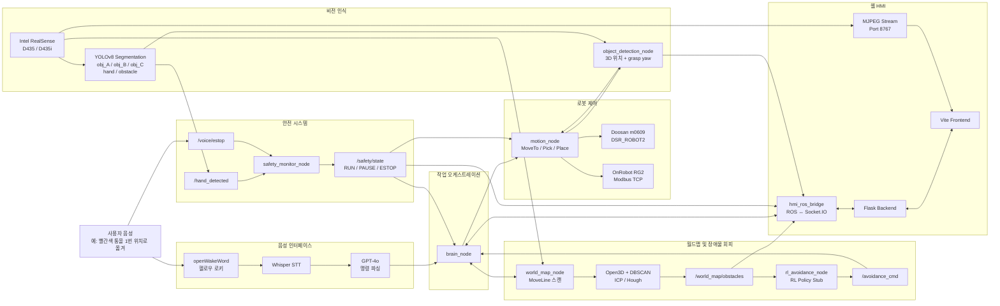

# 2026_ROKEY_RL-Avoid-Obstacle

> **Doosan m0609 협동로봇이 자연어 음성 명령을 이해하고, YOLOv8 세그멘테이션으로 색깔 통을 찾아 장애물을 회피하며 Pick & Place를 수행하는 ROS 2 통합 시스템**


**ROKEY 부트캠프 · Doosan Robotics 프로젝트**

---

## Overview

`2026_ROKEY_RL-Avoid-Obstacle`은 **음성, 비전, 로봇 제어, 안전, 환경 인지, 웹 HMI**를 하나의 ROS 2 시스템으로 통합한 협동로봇 Pick & Place 프로젝트입니다.

사용자가 다음과 같이 명령하면,

> **“헬로우 로키, 빨간색 통을 1번 위치로 옮겨.”**

시스템은 음성을 텍스트로 변환하고, GPT-4o로 작업 명령을 해석한 뒤, RealSense 카메라와 YOLOv8 세그멘테이션을 이용해 빨간색 통의 3차원 위치와 파지 각도를 계산합니다. 이후 Doosan m0609 협동로봇과 OnRobot RG2 그리퍼가 물체를 집어 지정된 위치로 이동합니다.

작업 중에는 사람의 손과 음성 정지 명령을 감지해 로봇을 일시정지하거나 비상정지하며, 포인트클라우드 기반 월드맵과 장애물 정보를 HMI에서 실시간으로 확인할 수 있습니다.


### 인식 대상

| 클래스        | 대상    |
| ---------- | ----- |
| `obj_A`    | 빨간색 통 |
| `obj_B`    | 파란색 통 |
| `obj_C`    | 초록색 통 |
| `hand`     | 사람 손  |
| `obstacle` | 장애물   |

* YOLO 모델: `yolov8s_seg_250.pt`
* 클래스 매핑: `class_name_tool.json`

---

## Key Features

### 자연어 음성 제어

* openWakeWord 기반 **“헬로우 로키”** 웨이크워드 감지
* OpenAI Whisper 기반 STT
* GPT-4o와 LangChain을 이용한 자연어 명령 파싱
* 한 번 웨이크업한 뒤 세션 동안 재호출 없이 연속 명령 가능
* 작업 명령, 월드맵 업데이트, 정지 및 재시작 명령 지원

### YOLOv8 세그멘테이션 비전

* RealSense RGB-D 영상과 커스텀 YOLOv8 세그멘테이션 모델 연동
* 빨간색·파란색·초록색 통 인식
* 대상 물체의 3차원 위치 계산
* 세그멘테이션 결과를 이용한 파지 회전각 `grasp yaw` 추정
* 다중 프레임 결과 집계를 통한 안정적인 검출
* 사람 손 감지 결과를 안전 시스템으로 전달

### 로봇 Pick & Place 제어

* Doosan `DSR_ROBOT2` 기반 로봇 제어
* `MoveTo`, `Pick`, `Place` 커스텀 액션 제공
* 스캔 스윕을 수행하며 물체가 보일 때까지 탐색
* OnRobot RG2 그리퍼를 이용한 물체 파지
* 그리퍼 너비를 기반으로 파지 성공 여부 검증
* 파지 실패 시 재시도 수행

### 안전 시스템

* 손 감지 시 소프트 일시정지 `PAUSE`
* 음성 **“정지”**, **“멈춰”** 입력 시 하드 정지 `ESTOP`
* 안전 상태를 `RUN`, `PAUSE`, `ESTOP`으로 관리
* `brain_node`와 `motion_node`가 각각 안전 상태를 구독
* 고수준 작업 흐름과 실시간 로봇 제어 계층에서 이중으로 안전 상태 확인
* **“다시 시작해”** 명령으로 안전 래치 해제

### 포인트클라우드 월드맵

* 음성 **“월드맵 업데이트 해줘”** 명령으로 스캔 시작
* 로봇 `MoveLine` 동작과 RealSense 포인트클라우드 연동
* DBSCAN 기반 장애물 클러스터링
* 원기둥 형태의 장애물 목록 생성 및 발행
* Open3D voxel 처리 및 ICP 정합 활용
* Hough circle 기반 장애물 분석 실험 지원
* 스캔 결과를 `data/world_maps/`에 관리

### RL 장애물 회피

* 월드맵 및 실시간 장애물 정보 구독
* 장애물 정보를 바탕으로 `/avoidance_cmd` 생성
* 강화학습 정책 로드 및 추론 부분은 현재 **stub 상태**

### 실시간 웹 HMI

* Flask 백엔드와 Vite 프론트엔드
* Socket.IO 기반 ROS ↔ 웹 실시간 통신
* RealSense 카메라 MJPEG 스트리밍
* 작업 상태 및 안전 상태 표시
* 음성 명령 로그 표시
* TCP Z축 정렬 게이지
* 월드 및 로봇 3D 뷰어
* `TF-only` / `TF+ICP` 비교
* `DBSCAN` / `DBSCAN+Hough` 비교 토글

---

## System Architecture

### 전체 데이터 흐름



### 서브시스템 구성

| 서브시스템   | 주요 구성                                             | 역할                             |
| ------- | ------------------------------------------------- | ------------------------------ |
| 음성      | `get_keyword_node`, openWakeWord, Whisper, GPT-4o | 사용자 음성을 ROS 작업 명령으로 변환         |
| 오케스트레이션 | `brain_node`                                      | 음성 명령, 비전, 로봇 액션, 안전 상태를 통합 관리 |
| 비전      | `object_detection_node`, RealSense, YOLOv8 Seg    | 물체와 손을 인식하고 3D 위치 및 파지 각도를 계산  |
| 제어      | `motion_node`, DSR_ROBOT2, RG2                    | 탐색, 이동, 파지, 배치 및 파지 성공 검증      |
| 안전      | `safety_monitor_node`                             | 손 감지와 음성 정지 요청을 통합해 안전 상태 발행   |
| 환경 인지   | `world_map_node`, DBSCAN, ICP, Hough              | 포인트클라우드로 월드맵과 장애물 목록 생성        |
| 장애물 회피  | `rl_avoidance_node`                               | 장애물 정보를 구독하고 회피 명령 생성          |
| HMI     | Flask, Socket.IO, Vite, MJPEG                     | 카메라, 작업, 안전, 음성, 월드맵 상태 시각화    |

---

## Tech Stack

| 영역     | 기술                                                                                             |
| ------ | ---------------------------------------------------------------------------------------------- |
| 로보틱스   | ROS 2 Humble, Doosan DSR_ROBOT2, `doosan-robot2`, OnRobot RG2                                  |
| 비전     | Intel RealSense, `librealsense2`, `realsense2_camera`, Ultralytics YOLOv8 Segmentation, OpenCV |
| 음성·LLM | openWakeWord, OpenAI Whisper, GPT-4o, LangChain, PyAudio, sounddevice                          |
| 환경 인지  | Open3D, DBSCAN, ICP, Hough Circle                                                              |
| 장애물 회피 | 월드맵 기반 회피 명령, RL 정책 추론 stub                                                                    |
| HMI    | Flask, Socket.IO, Vite, MJPEG                                                                  |
| 언어     | Python, JavaScript                                                                             |
| 통신     | ROS 2 Topic, Service, Action, Socket.IO, Modbus TCP                                            |

---

## Repository Structure

```text
robot_ws/
├── src/
│   ├── my_robot_pkg/
│   │   ├── brain_node
│   │   ├── motion_node
│   │   ├── robot_action_node
│   │   └── resource/
│   │       └── T_gripper2camera.npy
│   │
│   ├── object_detection/
│   │   ├── object_detection_node
│   │   ├── depth_probe
│   │   ├── angle_probe
│   │   └── yolo_probe
│   │
│   ├── voice_interface/
│   │   ├── get_keyword_node
│   │   ├── MicController
│   │   ├── stt
│   │   ├── tts
│   │   ├── voice_logger
│   │   └── resource/
│   │       ├── .env
│   │       └── hello_rokey_8332_32.tflite
│   │
│   ├── safety_monitor/
│   │   └── safety_monitor_node
│   │
│   ├── pointcloud_perception/
│   │   ├── world_map_node
│   │   ├── pointcloud_node
│   │   └── offline ICP / Hough 실험 스크립트
│   │
│   ├── obstacle_avoidance/
│   │   └── rl_avoidance_node
│   │
│   ├── hmi_ros_bridge/
│   │   ├── hmi_ros_bridge_server
│   │   ├── hmi_vision_stream
│   │   └── hmi_bringup.launch.py
│   │
│   ├── hmi_bridge/
│   ├── hmi_interface/
│   │   ├── hmi_interface_server
│   │   ├── hmi_voice_bridge
│   │   └── hmi_vision_bridge
│   │
│   ├── od_msg/
│   │   └── srv/
│   │       ├── SrvDepthPosition.srv
│   │       └── SrvVisibilityCheck.srv
│   │
│   ├── robot_interfaces/
│   │   ├── action/
│   │   │   ├── MoveTo.action
│   │   │   ├── Pick.action
│   │   │   └── Place.action
│   │   └── msg/
│   │       └── SafetyState.msg
│   │
│   └── obstacle_avoidance_msgs/
│       └── msg/
│           ├── AvoidanceCmd.msg
│           ├── WorldMapObstacle.msg
│           └── WorldMapUpdate.msg
│
├── hmi/
│   ├── backend/
│   │   ├── requirements.txt
│   │   └── .venv/
│   ├── frontend/
│   │   └── Vite application
│   └── schemas/
│       ├── command
│       ├── safety_status
│       └── task_status
│
├── docs/
│   ├── emergency_stop.md
│   ├── node_architecture_*.drawio
│   └── demo.gif
│
└── data/
    └── world_maps/
```

### ROS 2 패키지

| 패키지                       | 빌드 타입          | 주요 역할                                    |
| ------------------------- | -------------- | ---------------------------------------- |
| `my_robot_pkg`            | `ament_python` | 작업 오케스트레이션, 로봇 및 그리퍼 제어, 액션 실행           |
| `object_detection`        | `ament_python` | RealSense·YOLO 기반 객체 3D 위치 및 각도 계산, 손 감지 |
| `voice_interface`         | `ament_python` | 웨이크워드, STT, LLM 명령 파싱, TTS 및 음성 로그       |
| `safety_monitor`          | `ament_python` | 손 감지와 음성 정지 요청 통합, 하드 정지 처리              |
| `pointcloud_perception`   | `ament_python` | 월드맵 스캔, DBSCAN 장애물 클러스터링, ICP/Hough 실험   |
| `obstacle_avoidance`      | `ament_python` | 장애물 정보 구독 및 회피 명령 생성                     |
| `hmi_ros_bridge`          | `ament_python` | ROS와 Socket.IO 간 브릿지, MJPEG 영상 스트림       |
| `hmi_bridge`              | `ament_python` | Flask 기반 HMI 브릿지                         |
| `hmi_interface`           | `ament_python` | HMI 서버 및 음성·비전 브릿지 노드                    |
| `od_msg`                  | `ament_cmake`  | 객체 위치 및 가시성 확인 서비스 정의                    |
| `robot_interfaces`        | `ament_cmake`  | 로봇 액션과 안전 상태 메시지 정의                      |
| `obstacle_avoidance_msgs` | `ament_cmake`  | 회피 명령 및 월드맵 메시지 정의                       |

---

## Custom Interfaces / API

### Services

| 인터페이스                           | Request         | Response                                          | 용도                      |
| ------------------------------- | --------------- | ------------------------------------------------- | ----------------------- |
| `od_msg/srv/SrvDepthPosition`   | `string target` | `float64[] depth_position`<br>`float64 angle_deg` | 대상 물체의 3D 위치와 파지 회전각 조회 |
| `od_msg/srv/SrvVisibilityCheck` | `string target` | `bool visible`                                    | 대상 물체의 현재 가시성 확인        |

### Actions

| 인터페이스                            | Goal                                       | Result                              | Feedback           |
| -------------------------------- | ------------------------------------------ | ----------------------------------- | ------------------ |
| `robot_interfaces/action/MoveTo` | `pose[6]`, `label`                         | `success`, `message`                | `phase`            |
| `robot_interfaces/action/Pick`   | `object_label`, `scan_pose`, `scan_pose_b` | `success`, `picked_pose`, `message` | `phase`, `attempt` |
| `robot_interfaces/action/Place`  | `target_pose`                              | `success`, `message`                | `phase`            |

### Messages

| 인터페이스                                          | 주요 필드             | 용도               |
| ---------------------------------------------- | ----------------- | ---------------- |
| `robot_interfaces/msg/SafetyState`             | `state`, `reason` | 시스템 안전 상태와 원인 전달 |
| `obstacle_avoidance_msgs/msg/AvoidanceCmd`     | 메시지 정의 파일 참조      | 장애물 회피 명령 전달     |
| `obstacle_avoidance_msgs/msg/WorldMapObstacle` | 메시지 정의 파일 참조      | 월드맵 장애물 정보 전달    |
| `obstacle_avoidance_msgs/msg/WorldMapUpdate`   | 메시지 정의 파일 참조      | 월드맵 갱신 정보 전달     |

`SafetyState.state` 값은 다음과 같습니다.

| 상태      |   값 | 의미                  |
| ------- | --: | ------------------- |
| `RUN`   | `0` | 정상 실행               |
| `PAUSE` | `1` | 손 감지 등에 의한 소프트 일시정지 |
| `ESTOP` | `2` | 음성 정지 등에 의한 하드 정지   |

---

## Prerequisites

### 하드웨어

* Doosan m0609 협동로봇

  * `ROBOT_ID=dsr01`
* OnRobot RG2 그리퍼

  * Modbus TCP 연결
* Intel RealSense D435 또는 D435i

  * 그리퍼 장착
  * Hand-eye calibration 필요
* 마이크
* 스피커

### 외부 ROS 2 의존성

다음 구성요소는 이 워크스페이스에 포함되어 있지 않으므로 별도로 설치하고 먼저 실행해야 합니다.

* ROS 2 Humble
* `doosan-robot2`

  * `dsr_common2`
  * `controller2`
  * `hardware2`
  * `msgs2`
  * `bringup2`
* Intel RealSense SDK

  * `librealsense2`
  * `realsense2_camera`

`motion_node`와 `safety_monitor_node`는 다음 모듈을 직접 사용합니다.

* `DSR_ROBOT2`
* `DR_init`
* `dsr_msgs2`

로봇 드라이버와 RealSense 카메라 노드는 이 워크스페이스의 launch 파일에 포함되어 있지 않습니다.

### Python 의존성

PyAudio 설치에 필요한 시스템 패키지를 설치합니다.

```bash
sudo apt update
sudo apt install -y portaudio19-dev
```

ROS 의존성 외에 필요한 Python 패키지를 설치합니다.

```bash
pip install --user \
  ultralytics \
  opencv-python \
  numpy \
  scipy \
  openai \
  langchain \
  langchain-openai \
  python-dotenv \
  pyaudio \
  sounddevice \
  openwakeword \
  websockets \
  open3d
```

### OpenAI API Key

음성 인터페이스를 사용하려면 OpenAI API 키가 필요합니다.

```bash
cd ~/robot_ws

mkdir -p src/voice_interface/resource

cat > src/voice_interface/resource/.env <<'EOF'
OPENAI_API_KEY=sk-...
EOF
```

`.env` 파일은 Git 추적 대상에서 제외됩니다.

---

## Build

```bash
cd ~/robot_ws

source /opt/ros/humble/setup.bash
source ~/<doosan-robot2-workspace>/install/setup.bash

colcon build

source install/setup.bash
```

새 터미널을 열 때마다 다음 환경을 다시 불러와야 합니다.

```bash
source /opt/ros/humble/setup.bash
source ~/<doosan-robot2-workspace>/install/setup.bash
source ~/robot_ws/install/setup.bash
```

---

## Run

로봇 드라이버와 RealSense 카메라는 별도 워크스페이스에서 먼저 실행합니다.

각 애플리케이션 노드는 `wait_for_service` 또는 `wait_for_server`를 이용해 연결 대상을 기다리므로, ROS 애플리케이션 노드 사이의 기동 순서는 고정되어 있지 않습니다.

### 1. Doosan 로봇 드라이버 실행

```bash
source /opt/ros/humble/setup.bash
source ~/<doosan-robot2-workspace>/install/setup.bash

ros2 launch dsr_bringup2 dsr_bringup2_rviz.launch.py \
  mode:=real \
  host:=<로봇IP> \
  model:=m0609
```

### 2. RealSense 카메라 실행

```bash
source /opt/ros/humble/setup.bash

ros2 launch realsense2_camera rs_launch.py
```

### 3. Pick & Place 애플리케이션 실행

```bash
source /opt/ros/humble/setup.bash
source ~/<doosan-robot2-workspace>/install/setup.bash
source ~/robot_ws/install/setup.bash

ros2 launch my_robot_pkg pnp_bringup.launch.py
```

### 4. HMI ROS 브릿지 실행

```bash
source /opt/ros/humble/setup.bash
source ~/robot_ws/install/setup.bash

ros2 launch hmi_ros_bridge hmi_bringup.launch.py
```

### 5. HMI 웹 백엔드 준비

Flask 백엔드는 ROS 노드와 별도로 Python 가상환경에서 실행합니다.

```bash
cd ~/robot_ws/hmi/backend

python3 -m venv .venv
source .venv/bin/activate

pip install -r requirements.txt
```

```bash
# 백엔드 실행 엔트리포인트 확인 필요
```

### 6. HMI 웹 프론트엔드 준비

Vite 프론트엔드는 ROS 노드와 별도로 실행합니다.

```bash
cd ~/robot_ws/hmi/frontend

npm install
npm run
```

`npm run`으로 `package.json`에 등록된 실행 스크립트를 확인한 뒤 해당 스크립트를 실행합니다.

```bash
# 프론트엔드 실행 스크립트명 확인 필요
# npm run <script-name>
```

---

## Voice Command Usage

### 기본 사용 순서

1. **“헬로우 로키”**라고 말해 음성 세션을 시작합니다.
2. 물체와 목적지를 포함한 자연어 명령을 말합니다.
3. 세션이 유지되는 동안 웨이크워드를 다시 말하지 않고 연속 명령할 수 있습니다.
4. 긴급 상황에서는 **“정지”** 또는 **“멈춰”**라고 말합니다.
5. 정지 상태를 해제하려면 **“다시 시작해”**라고 말합니다.

### 물체 이름 매핑

| 사용자 표현 | 내부 객체   |
| ------ | ------- |
| 빨간색 통  | `obj_A` |
| 파란색 통  | `obj_B` |
| 초록색 통  | `obj_C` |

### 명령 예시

```text
헬로우 로키
```

```text
빨간색 통을 1번 위치로 옮겨
```

```text
파란색 통을 2번 위치로 옮겨
```

```text
초록색 통을 3번 위치로 옮겨
```

```text
월드맵 업데이트 해줘
```

```text
정지
```

```text
멈춰
```

```text
다시 시작해
```

### 명령별 동작

| 음성 명령                  | 시스템 동작                     |
| ---------------------- | -------------------------- |
| `헬로우 로키`               | 웨이크워드 감지 및 음성 세션 시작        |
| `<색상> 통을 <번호>번 위치로 옮겨` | 대상 객체 인식 후 Pick & Place 실행 |
| `월드맵 업데이트 해줘`          | 로봇 스캔 및 장애물 목록 갱신          |
| `정지`, `멈춰`             | `ESTOP` 하드 정지              |
| `다시 시작해`               | 안전 래치 해제 및 실행 상태 복귀        |

---

## Configuration & Calibration

실제 로봇 셀에서 실행하기 전에 다음 값을 환경에 맞게 변경해야 합니다.

| 구분                   | 파일 또는 설정                                     | 변경 항목                      | 설명                                      |
| -------------------- | -------------------------------------------- | -------------------------- | --------------------------------------- |
| 로봇                   | `motion_node.py`                             | `ROBOT_ID`, `ROBOT_MODEL`  | 로봇 ID와 모델 설정                            |
| 안전 시스템               | `safety_monitor_node` 파라미터                   | `robot_id`                 | 안전 정지 명령을 전달할 로봇 ID                     |
| RG2 연결               | `motion_node.py`                             | `TOOLCHARGER_IP`, `PORT`   | 그리퍼 Modbus TCP 연결 정보                    |
| RG2 파라미터             | `gripper.py`                                 | 최대 폭, 파지 힘                 | 실제 그리퍼와 대상 물체에 맞게 설정                    |
| 파지 검증                | launch 파라미터                                  | `grip_min_width_mm`        | 파지 성공 판정 최소 너비                          |
| 로봇 자세                | `brain_node.py`                              | `POSITION_COORDS`          | `home`, `scan`, `target1~3` 좌표를 셀마다 재티칭 |
| Hand-eye calibration | `my_robot_pkg/resource/T_gripper2camera.npy` | 변환 행렬                      | 카메라를 재장착한 경우 재캘리브레이션                    |
| 파지 각도                | `motion_node.py`                             | `GRASP_AXIS_IMG_ANGLE_DEG` | 이미지 기준 그리퍼 축 각도                         |
| 파지 각도                | `motion_node.py`                             | `GRASP_ANGLE_SIGN`         | 계산된 각도의 방향 부호                           |
| 마이크                  | `robot_get_keyword_node.py`                  | `device_index`             | 사용 중인 마이크 장치 인덱스                        |
| 웨이크워드                | `hello_rokey_8332_32.tflite`                 | 모델 파일                      | 웨이크워드 변경 시 openWakeWord 모델 재학습          |
| YOLO 모델              | `yolo.py`                                    | `YOLO_MODEL_FILENAME`      | 사용할 YOLO 세그멘테이션 모델 파일                   |
| 클래스 매핑               | `class_name_tool.json`                       | 클래스 이름 및 ID                | YOLO 모델 클래스 순서와 일치 여부 확인                |

### 로봇 위치 재티칭

다음 좌표는 실제 작업 셀을 기준으로 다시 설정해야 합니다.

* `home`
* `scan`
* `target1`
* `target2`
* `target3`

```python
# brain_node.py
POSITION_COORDS = {
    # 실제 작업 셀 좌표로 재티칭 필요
}
```

### Hand-eye calibration

카메라를 그리퍼에서 분리하거나 장착 위치를 변경한 경우 다음 파일을 다시 생성해야 합니다.

```text
my_robot_pkg/resource/T_gripper2camera.npy
```

### Grasp yaw calibration

다음 상수는 `angle_probe`를 이용해 실제 카메라 영상과 그리퍼 축을 측정한 뒤 조정해야 합니다.

```python
GRASP_AXIS_IMG_ANGLE_DEG = ...  # 실측 필요
GRASP_ANGLE_SIGN = ...          # 방향 확인 필요
```

### YOLO 클래스 확인

YOLO 모델의 클래스 순서와 `class_name_tool.json`의 매핑이 일치해야 합니다.

```text
obj_A     = 빨간색 통
obj_B     = 파란색 통
obj_C     = 초록색 통
hand      = 사람 손
obstacle  = 장애물
```

---

## Roadmap / TODO

* [ ] `rl_avoidance_node`의 실제 강화학습 정책 파일 로드 구현
* [ ] 월드맵 및 실시간 장애물 상태를 입력으로 사용하는 RL 정책 추론 구현
* [ ] RL 추론 결과를 이용한 실환경 장애물 회피 동작 검증
* [ ] `GRASP_AXIS_IMG_ANGLE_DEG` 실측 및 보정
* [ ] `GRASP_ANGLE_SIGN` 방향 검증
* [ ] 실제 작업 셀 기준 `home`, `scan`, `target1~3` 좌표 재티칭
* [ ] 카메라 재장착 환경에 대한 Hand-eye calibration 재수행
* [ ] 대상 통 크기와 RG2 설정에 따른 파지 너비 및 힘 보정

> 현재 장애물 정보 구독과 회피 명령 생성 구조는 구현되어 있으나, 강화학습 정책 로드 및 추론은 stub 상태입니다.

---

## Documentation

| 경로                                | 내용                    |
| --------------------------------- | --------------------- |
| `docs/emergency_stop.md`          | 비상정지 및 안전 시스템 설계 문서   |
| `docs/node_architecture_*.drawio` | ROS 2 노드 아키텍처 다이어그램   |
| `data/world_maps/`                | 포인트클라우드 기반 월드맵 스캔 데이터 |

---

## Author & License

### Author

* **soo**
* Email: [poi3824@gmail.com](mailto:poi3824@gmail.com)

### License

<!-- License 확인 필요 -->
