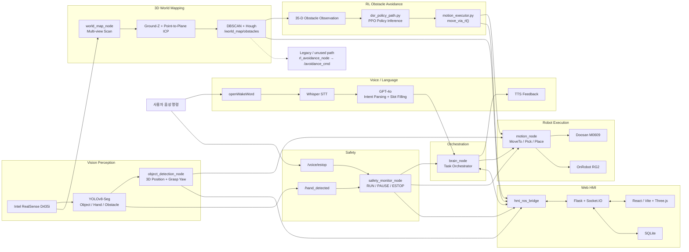
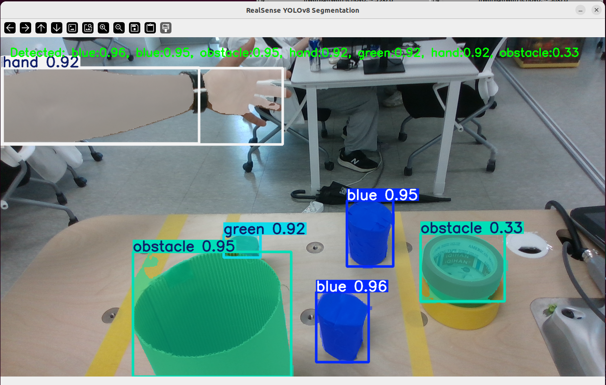
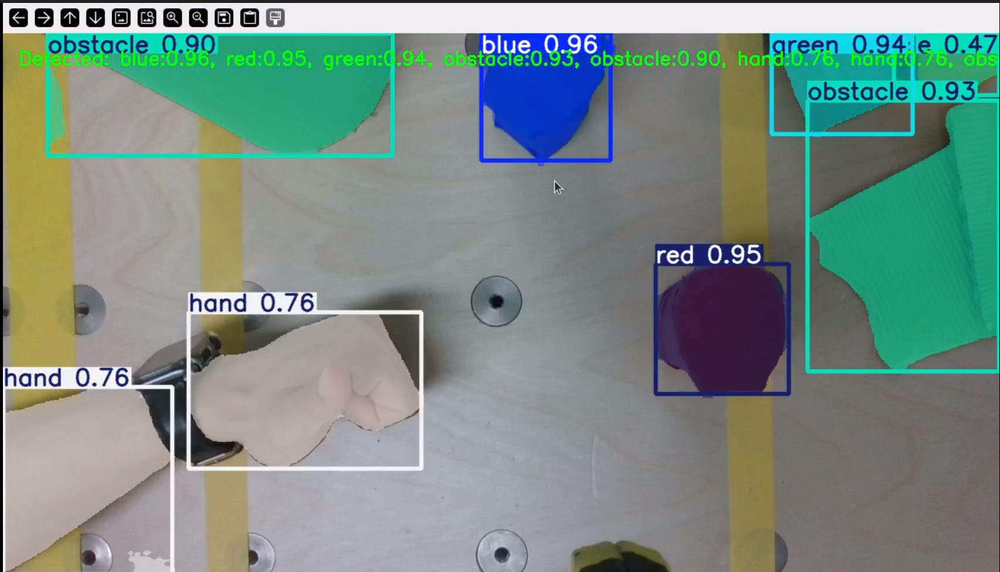
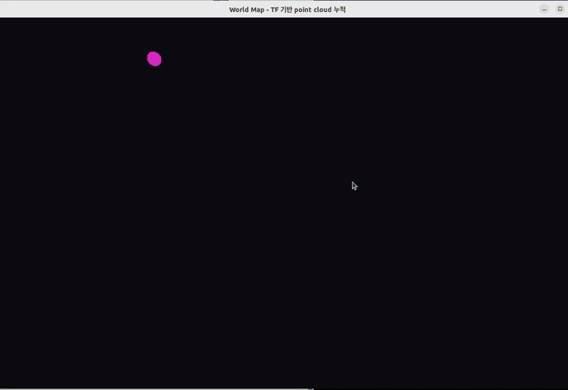
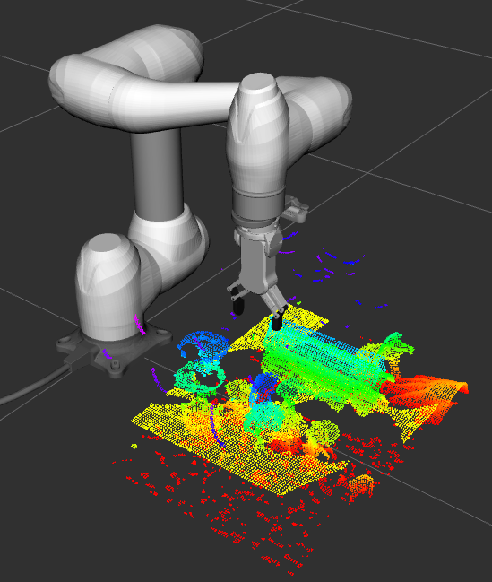
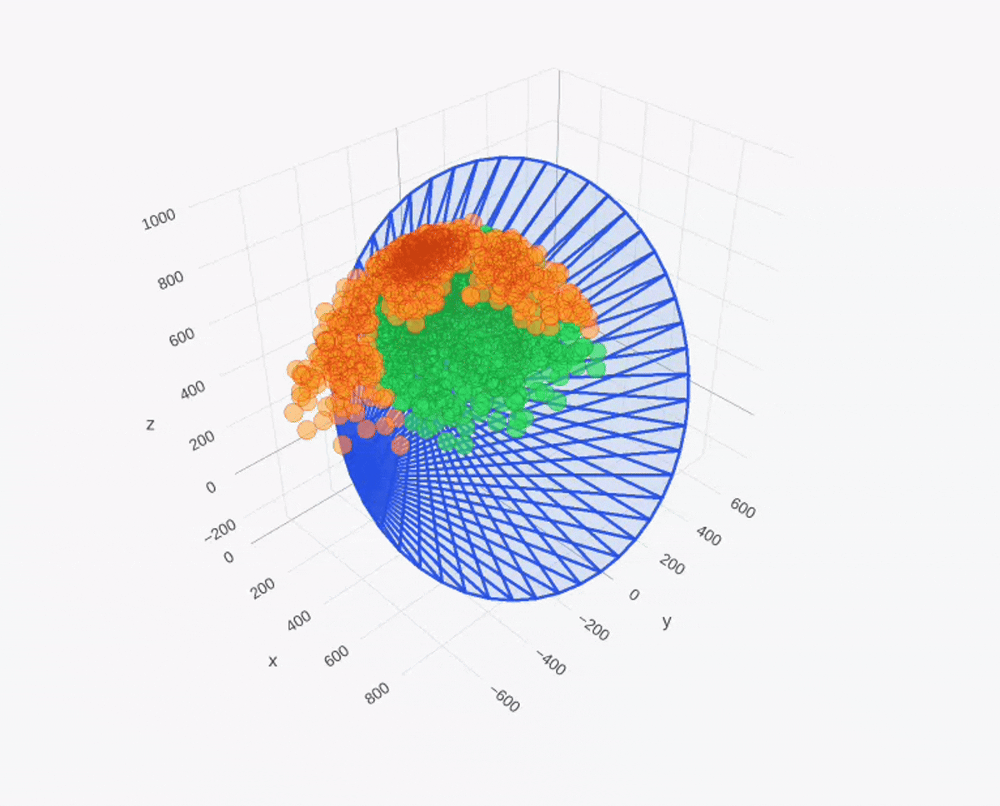
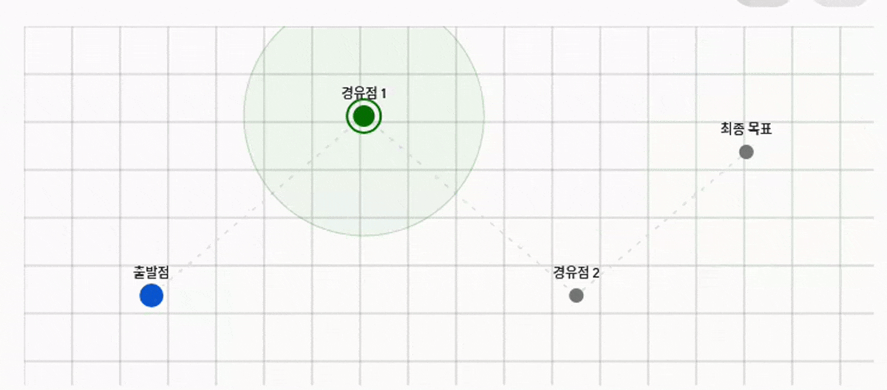

<div align="center">

# ALAS — AI Laboratory Assistant System

### Vision + Language + Action + Reinforcement Learning 기반 협동로봇 작업 어시스턴트

**Doosan M0609 · Intel RealSense · YOLOv8-Seg · 3D World Map · PPO Obstacle Avoidance · ROS 2 Humble**


**ROKEY 부트캠프 협동 2 · B그룹 2조 · 2026.07**

</div>

---

## 1. Project Overview

`ALAS`는 사용자의 자연어 음성 명령을 해석하고, RGB-D 비전으로 작업 대상을 인식한 뒤, 3D World Map에서 추출한 장애물 정보를 활용해 협동로봇이 안전하게 Pick & Place를 수행하도록 구성한 ROS 2 통합 시스템입니다.

예를 들어 사용자가 다음과 같이 명령합니다.

> **“헬로우 로키, 빨간색 통을 1번 위치로 옮겨.”**

시스템은 아래 흐름으로 작업을 수행합니다.

1. openWakeWord와 Whisper로 음성을 인식합니다.
2. GPT-4o 기반 명령 파싱 및 Slot Filling으로 객체와 목적지를 확정합니다.
3. YOLOv8-Seg와 RealSense Depth로 대상의 3D 위치, 형상, 파지 각도를 계산합니다.
4. 그리퍼 장착 카메라를 이동시키며 다중 시점 Point Cloud를 취득합니다.
5. TF, Ground-Z 보정, Point-to-Plane ICP로 3D World Map을 생성합니다.
6. DBSCAN과 Hough Circle Transform으로 장애물 중심·반경·높이를 추출합니다.
7. PPO 정책이 월드맵 장애물 관측을 입력받아 6-DOF Joint Delta를 실시간 추론합니다.
8. Doosan M0609와 OnRobot RG2가 장애물을 회피하며 Pick & Place를 완료합니다.
9. 작업 상태, 안전 상태, Vision, World Map, RL 진행 상황을 HMI에서 모니터링합니다.

### 핵심 구현 결과

| 영역 | 구현 결과 |
|---|---|
| Voice / LLM | Wake Word, Whisper STT, GPT-4o 명령 파싱, Pending Command + Slot Filling, TTS 재질문 |
| Vision | YOLOv8-Seg 기반 객체·손·장애물 인식, Depth 기반 3D 좌표, 파지각 및 그리퍼 정렬 |
| World Map | 다중 시점 Point Cloud, Ground-Z + Point-to-Plane ICP, DBSCAN + Hough 재검출 |
| RL | MoveIt BC Pre-training → PPO Fine-tuning, 12단계 커리큘럼, 실기 체크포인트 로드 및 추론 |
| Robot | `MoveTo`, `Pick`, `Place` Action 기반 실행, RG2 파지 검증 및 재시도 |
| Safety | 손 감지 `PAUSE`, 음성 정지 `ESTOP`, Brain/Motion 이중 안전 확인 |
| HMI | Flask + Socket.IO + React/Vite 기반 통합 대시보드 및 SQLite 로그 |

---

## 2. System Architecture



> `rl_avoidance_node.py`의 `/avoidance_cmd` 경로는 초기 Cartesian 보정 실험용 Stub으로 남아 있습니다. 실제 로봇의 장애물 회피는 `dsr_policy_path.py`와 `motion_executor.py`의 `move_via_rl()` 경로에서 수행됩니다.

---

## 3. Core Technologies

### 3.1 Voice Interface — STT, LLM, Slot Filling, TTS

- openWakeWord 기반 **“헬로우 로키”** 감지
- Whisper 기반 Speech-to-Text
- GPT-4o + LangChain 기반 구조화 명령 파싱
- 객체·목적지 정보가 부족할 경우 Pending Command 유지
- Slot Filling과 TTS 재질문으로 불완전한 명령 보완
- “정지”, “멈춰”, “다시 시작해”, “그거 손 아니야”, “다시 말할게” 등 예외 명령 처리

```text
Wake Word → STT → LLM Parsing → Slot Validation
          → TTS Question → Slot Completion → ROS Action Goal
```

### 3.2 YOLOv8-Seg Vision and Safety Monitoring


- RealSense RGB-D 영상과 커스텀 YOLOv8-Seg 모델 연동
- `obj_A`, `obj_B`, `obj_C`, `hand`, `obstacle` 클래스 인식
- Segmentation Mask 기반 실제 형상과 짧은 변 추출
- `minAreaRect` 기반 회전각 계산 및 Gripper 축 정렬
- Depth ROI의 Median 값으로 표면 깊이 계산
- Hand Detection과 Pick Detection을 별도 Callback Group으로 분리
- 최근 프레임 Majority Voting Buffer로 손 오탐지 완화

<p align="center">
  
  
</p>

### 3.3 Multi-view 3D World Mapping



그리퍼에 장착된 Depth Camera를 로봇이 직접 이동시키며 여러 시점의 Point Cloud를 취득합니다. 각 스캔을 `base_link` 기준으로 변환하고 정합해 고정 카메라의 가림, Depth Shadow, 단일 시점 한계를 보완합니다.

```text
Depth Point Cloud
→ Camera Frame / TF Transform
→ Base Frame Alignment
→ Ground-Z Compensation
→ Point-to-Plane ICP
→ Voxel Downsampling
→ Accumulated 3D World Map
```

<p align="center">
  
  
</p>

#### 장애물 파라미터 추출

- 바닥 밴드 제거 및 Flying Pixel Outlier 제거
- DBSCAN 기반 1차 장애물 군집화
- 최소 Point 수와 높이 조건을 이용한 후보 필터링
- XY Height Image + Hough Circle Transform으로 근접 원통 장애물 재분리
- 장애물 중심 `(x, y, z)`, 반경, 높이, 신뢰도 생성
- `/world_map/obstacles` 토픽으로 RL과 HMI에 전달

### 3.4 Reinforcement Learning Obstacle Avoidance

#### 학습 파이프라인


1. **MoveIt Expert Demonstration**  
   장애물 회피 경로를 생성해 약 9천 개 수준의 시연 궤적을 수집합니다.
2. **Behavior Cloning Pre-training**  
   Actor가 전문가의 Joint Delta 행동을 모방하도록 사전학습합니다.
3. **Weight Transfer**  
   BC Actor 가중치를 PPO Actor에 이식하고 `log_std`를 재초기화합니다.
4. **Critic Warm-up**  
   초기 50 Iteration 동안 Actor를 Freeze하고 Critic을 먼저 안정화합니다.
5. **12-stage Curriculum Fine-tuning**  
   장애물의 경로 직교 오프셋을 단계적으로 줄이며 난도를 높이고, 동시에 Entropy, Action Rate, Joint Velocity 규제를 조정합니다.

#### 실시간 정책 추론 경로

```text
/world_map/obstacles
→ load_latest_world_map_obstacles()
→ obstacles_to_obs_block()
→ get_live_obstacles_obs()
→ 35-D Obstacle Observation
→ PPO Actor
→ 6-DOF Joint Delta
→ move_via_rl()
→ Doosan M0609 Joint Command
```

- 실기 체크포인트: `model_10000_obs_avoid.pt`
- 추가 Smooth 체크포인트: `model_14000_smooth.pt`
- 학습 지표: `success_ema = 0.992`, `collision_ema = 0.0003`
- Pick 이후 Place 이동을 시작할 때 RL 경로 실행
- 실제 로봇에서 World Map 기반 장애물 회피 추론 검증 완료


#### Reachable Workspace and Waypoint Concept

<p align="center">
  
  
</p>

### 3.5 Pick & Place and Safety

#### Pick

```text
Hover
→ Depth Surface-Z Measurement
→ Gripper Yaw Alignment
→ 10 mm Step Descent
→ RG2 Grip
→ Width-based Grip Validation
→ Retract
```

#### Place

```text
Pick Success
→ Load Live World Map Obstacles
→ PPO move_via_rl()
→ Target Hover
→ Depth-based Descent
→ RG2 Release
→ Retract / Home
```

#### Safety State

| State | Value | Trigger | Behavior |
|---|---:|---|---|
| `RUN` | 0 | 정상 상태 | 작업 실행 |
| `PAUSE` | 1 | 손 감지 | 소프트 일시정지, 재개 가능 |
| `ESTOP` | 2 | 음성 정지 또는 비상 상황 | 하드 정지 및 안전 래치 |

### 3.6 HMI and Data Logging

- Main Dashboard: ROS Node, Task, Safety 상태
- STT-TTS: 음성 상태, 명령 로그, Slot Filling 진행
- Vision: RGB/Segmentation, Detection 정보
- World / Robot Viewer: Three.js 기반 3D 시각화
- Performance: RL 목표 거리, TCP 정렬, Gripper 각도
- SQLite: Pick 시도, 음성 이벤트, World Map Scan 결과 저장
- `TF-only / TF+ICP`, `DBSCAN / DBSCAN+Hough` 비교 토글

---

## 4. Tech Stack

| Category | Technologies |
|---|---|
| Robot | ROS 2 Humble, Doosan `DSR_ROBOT2`, M0609, OnRobot RG2, Modbus TCP |
| Vision | Intel RealSense D435i, `librealsense2`, `realsense2_camera`, YOLOv8-Seg, OpenCV |
| Voice / LLM | openWakeWord, Whisper, GPT-4o, LangChain, PyAudio, sounddevice |
| World Map | Point Cloud, TF2, Open3D, Voxel Downsampling, Point-to-Plane ICP, DBSCAN, Hough Circle |
| RL | NVIDIA Isaac Sim, Isaac Lab, PPO, Behavior Cloning, PyTorch, Curriculum Learning |
| Backend | Flask, Flask-SocketIO, SQLite, MJPEG Streaming |
| Frontend | React, Vite, Three.js, Socket.IO Client |
| Communication | ROS 2 Topic, Service, Action, Socket.IO, Modbus TCP |
| Language | Python, JavaScript / TypeScript |

---

## 5. Repository Structure

```text
.
├── src/
│   ├── my_robot_pkg/
│   │   ├── launch/
│   │   │   └── pnp_bringup.launch.py
│   │   ├── my_robot_pkg/
│   │   │   ├── brain_node.py
│   │   │   ├── motion_node.py
│   │   │   ├── motion_executor.py          # Pick/Place 및 move_via_rl 실행
│   │   │   ├── dsr_policy_path.py          # PPO 체크포인트 로드·정책 추론
│   │   │   ├── gripper.py
│   │   │   ├── pick_logger.py
│   │   │   ├── visualize_grasp_log.py
│   │   │   └── robot_action_node.py
│   │   └── resource/
│   │       ├── T_gripper2camera.npy
│   │       ├── model_10000_obs_avoid.pt
│   │       └── model_14000_smooth.pt
│   │
│   ├── object_detection/
│   │   └── object_detection/
│   │       ├── object_detection_node.py
│   │       ├── yolo.py
│   │       ├── depth_probe.py
│   │       └── angle_probe.py
│   │
│   ├── pointcloud_perception/
│   │   └── pointcloud_perception/
│   │       ├── world_map_node.py
│   │       ├── world_map_algo.py
│   │       ├── pointcloud_node.py
│   │       ├── animate_worldmap_accumulation.py
│   │       ├── visualize_obstacle_pipeline.py
│   │       ├── offline_icp_experiment.py
│   │       └── offline_hough_circle_validation.py
│   │
│   ├── voice_interface/
│   ├── safety_monitor/
│   ├── obstacle_avoidance/                  # Legacy /avoidance_cmd Stub
│   ├── hmi_ros_bridge/
│   ├── hmi_bridge/
│   ├── hmi_interface/
│   ├── od_msg/
│   ├── robot_interfaces/
│   └── obstacle_avoidance_msgs/
│
├── hmi/
│   ├── backend/
│   ├── frontend/
│   └── schemas/
│
├── docs/
│   ├── gifs/
│   │   ├── demo_system.gif
│   │   ├── vision_safety.gif
│   │   ├── worldmap_scan.gif
│   │   ├── worldmap_pipeline.gif
│   │   ├── rl_training.gif
│   │   ├── rl_real_robot.gif
│   │   └── waypoint_concept.gif
│   ├── images/
│   ├── emergency_stop.md
│   └── node_architecture_*.drawio
│
└── README.md
```

### ROS 2 Packages

| Package | Build Type | Role |
|---|---|---|
| `my_robot_pkg` | `ament_python` | Brain, Motion Action Server, Pick/Place, RG2, RL policy execution |
| `object_detection` | `ament_python` | YOLOv8-Seg, Depth, 3D Position, Grasp Angle, Hand Detection |
| `pointcloud_perception` | `ament_python` | Multi-view World Map, ICP, DBSCAN, Hough, Obstacle Publishing |
| `voice_interface` | `ament_python` | Wake Word, STT, LLM Parsing, Slot Filling, TTS |
| `safety_monitor` | `ament_python` | Hand / Voice Stop 통합 및 Safety State 관리 |
| `obstacle_avoidance` | `ament_python` | 초기 Cartesian `/avoidance_cmd` Stub, 현재 실기 경로에서는 미사용 |
| `hmi_ros_bridge` | `ament_python` | ROS ↔ Socket.IO, MJPEG Streaming |
| `robot_interfaces` | `ament_cmake` | `MoveTo`, `Pick`, `Place`, `SafetyState` |
| `obstacle_avoidance_msgs` | `ament_cmake` | World Map Obstacle / Update / Avoidance 메시지 |

---

## 6. Custom Interfaces

### Actions

| Interface | Goal | Result | Feedback |
|---|---|---|---|
| `robot_interfaces/action/MoveTo` | `pose[6]`, `label` | `success`, `message` | `phase` |
| `robot_interfaces/action/Pick` | `object_label`, `scan_pose`, `scan_pose_b` | `success`, `picked_pose`, `message` | `phase`, `attempt` |
| `robot_interfaces/action/Place` | `target_pose` | `success`, `message` | `phase` |

### Services

| Interface | Purpose |
|---|---|
| `od_msg/srv/SrvDepthPosition` | 대상 객체의 3D 위치와 파지 회전각 조회 |
| `od_msg/srv/SrvVisibilityCheck` | 대상 객체의 현재 가시성 확인 |
| `/update_world_map` | 로봇 스캔 및 World Map 갱신 |
| `/safety/stop` | Safety Stop 요청 |
| `/safety/reset` | Safety Latch 해제 |

### Main Topics

| Topic | Description |
|---|---|
| `/camera/camera/depth/color/points` | RealSense Depth Point Cloud |
| `/hand_detected` | 손 감지 상태 |
| `/safety/state` | `RUN`, `PAUSE`, `ESTOP` |
| `/world_map/obstacles` | 장애물 중심, 반경, 높이, 신뢰도 |
| `/hmi/rl_reach_progress` | RL 이동 거리 및 진행률 |
| `/hmi/grasp_angle_delta` | Gripper 정렬 오차 |

---

## 7. Prerequisites

### Hardware

- Doosan Robotics M0609
- OnRobot RG2 Gripper
- Intel RealSense D435i mounted on the gripper
- Robot Control PC: Ubuntu 22.04, ROS 2 Humble
- RL Training PC: NVIDIA GPU, Isaac Sim / Isaac Lab
- Microphone and Speaker

### External Dependencies

- ROS 2 Humble
- `doosan-robot2`
- `realsense2_camera`
- `librealsense2`
- Open3D
- Ultralytics YOLO
- PyTorch
- Flask / Flask-SocketIO
- Node.js / npm

### Python Packages

```bash
sudo apt update
sudo apt install -y portaudio19-dev

pip install --user \
  ultralytics \
  opencv-python \
  numpy \
  scipy \
  torch \
  openai \
  langchain \
  langchain-openai \
  python-dotenv \
  pyaudio \
  sounddevice \
  openwakeword \
  websockets \
  open3d
```

### OpenAI API Key

```bash
mkdir -p src/voice_interface/resource
cat > src/voice_interface/resource/.env <<'ENV'
OPENAI_API_KEY=sk-...
ENV
```

> `.env`, 체크포인트, 캘리브레이션 파일은 배포 정책과 용량을 확인한 뒤 관리합니다.

---

## 8. Build and Run

### Build

```bash
cd ~/RL-Avoid-Obstacle
source /opt/ros/humble/setup.bash
source ~/<doosan-robot2-workspace>/install/setup.bash

colcon build --symlink-install
source install/setup.bash
```

### 1) Doosan Robot Driver

```bash
ros2 launch dsr_bringup2 dsr_bringup2_rviz.launch.py \
  mode:=real \
  host:=192.168.1.100 \
  port:=12345 \
  model:=m0609
```

### 2) RealSense

```bash
ros2 launch realsense2_camera rs_align_depth_launch.py \
  depth_module.depth_profile:=848x480x30 \
  rgb_camera.color_profile:=1280x720x30 \
  initial_reset:=true \
  align_depth.enable:=true \
  enable_rgbd:=true \
  pointcloud.enable:=true
```

### 3) Camera TF

```bash
ros2 run tf2_ros static_transform_publisher \
  --x 0.00 --y 0.00 --z 0.08 \
  --roll -1.5708 --pitch -1.5708 --yaw 0.0 \
  --frame-id link_6 \
  --child-frame-id camera_link
```

### 4) Pick & Place Stack

```bash
source install/setup.bash
ros2 launch my_robot_pkg pnp_bringup.launch.py
```

### 5) HMI ROS Bridge

```bash
ros2 launch hmi_ros_bridge hmi_bringup.launch.py
```

### 6) HMI Backend / Frontend

```bash
cd hmi/backend
python3 -m venv .venv
source .venv/bin/activate
pip install -r requirements.txt
# 프로젝트 엔트리포인트로 Flask 실행
```

```bash
cd hmi/frontend
npm install
npm run dev
```

---

## 9. Voice Command Examples

```text
헬로우 로키
빨간색 통을 1번 위치로 옮겨
파란색 통을 2번 위치로 옮겨
초록색 통을 3번 위치로 옮겨
월드맵 업데이트 해줘
멈춰
다시 시작해
그거 손 아니야
다시 말할게
```

---

## 10. Configuration and Calibration

| Item | File / Parameter | Description |
|---|---|---|
| Robot Cell Pose | `brain_node.py` | `home`, `scan`, `target1~3` 좌표 재티칭 |
| Hand-eye | `resource/T_gripper2camera.npy` | 카메라 장착 위치 변경 시 재캘리브레이션 |
| RL Checkpoint | `dsr_policy_path.py` | 실제 사용할 `.pt` 파일 선택 |
| Grasp Axis | `motion_executor.py` | 이미지 축과 Gripper 축 오프셋 보정 |
| RG2 | `gripper.py` | 폭, 힘, Modbus IP/Port 설정 |
| YOLO | `yolo.py`, `class_name_tool.json` | 모델 경로와 클래스 순서 검증 |
| DDS | CycloneDDS XML | Point Cloud 통신용 인터페이스, Participant Index, UDP Buffer 설정 |

---

## 11. Implementation Status and Roadmap

### Completed

- [x] 자연어 음성 명령 및 Slot Filling
- [x] YOLOv8-Seg 객체·손·장애물 인식
- [x] Depth 기반 3D 위치 및 Gripper Align
- [x] Point Cloud 기반 Multi-view 3D World Map
- [x] Ground-Z + Point-to-Plane ICP 정합
- [x] DBSCAN 기반 장애물 군집화
- [x] Hough Circle 기반 근접 원통 장애물 재분리
- [x] MoveIt Expert Demonstration 및 BC Pre-training
- [x] PPO 커리큘럼 기반 장애물 회피 학습
- [x] `dsr_policy_path.py` 강화학습 정책 파일 로드
- [x] 월드맵 장애물 상태 기반 35차원 RL Observation 생성
- [x] `motion_executor.py::move_via_rl()` 실시간 정책 추론
- [x] RL 추론 결과를 이용한 실제 M0609 장애물 회피 검증
- [x] Flask / React HMI 및 SQLite Logging
- [x] 손 감지 PAUSE / 음성 ESTOP 안전 시스템

### Future Work

- [ ] 실시간으로 이동하는 동적 장애물 재인식 및 경로 재계획
- [ ] 더 다양한 크기·형상·재질의 장애물로 Domain Randomization 확장
- [ ] RL 실패 구간에 대한 추가 학습 및 정책 안정성 검증
- [ ] World Map Scan 시간 단축 및 Incremental Update
- [ ] HMI 알람, 작업 리포트, 재현 가능한 실험 세션 관리 강화
- [ ] 다수 로봇 및 다수 작업 셀 확장

---

## 12. Team

| Role | Name | Contribution |
|---|---|---|
| Mentor / Project Direction | 이충현 | 프로젝트 방향성, 기술 자문, Hough 재검출 제안, 발표자료 검토 |
| Team Lead / PM / Perception / Integration | 신지완 | 기획·통합, World Map, Vision, 시스템 아키텍처, HMI 연계 |
| RL / Obstacle Avoidance | 박준형 | Isaac Sim 환경, BC/PPO 학습, 커리큘럼, Sim-to-Real 적용 |
| Motion Control / Vision / HMI Integration | 박수영 | 로봇 제어, Pick & Place, Gripper, Vision Depth, HMI 연동 |
| STT / Data / Presentation | 김민성 | 음성 인터페이스, 데이터 라벨링, 문서화 및 발표자료 |

---

## 13. Documentation

| Path | Description |
|---|---|
| `docs/emergency_stop.md` | 비상정지 및 안전 시스템 설계 |
| `docs/node_architecture_*.drawio` | ROS 2 Node Architecture |
| `data/world_maps/` | World Map Scan and Obstacle Data |
| `docs/gifs/` | README용 경량 시연 GIF |
| `docs/images/` | Vision, World Map, RL 설명 이미지 |

---

<div align="center">

**AI Laboratory Assistant System — ALAS**  
Voice · Vision · 3D World Mapping · Reinforcement Learning · Collaborative Robot

</div>
