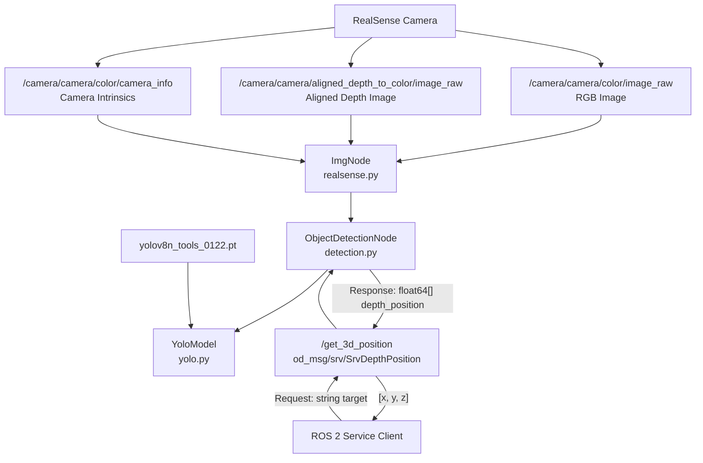

# RealSense YOLOv8 3D Object Position Service

RealSense 깊이 카메라와 YOLOv8을 이용해 지정된 공구를 탐지하고, 카메라 좌표계 기준 3차원 위치 `(x, y, z)`를 반환하는 ROS 2 서비스 패키지입니다.


---

## Overview

이 프로젝트는 **RealSense D400 계열 깊이 카메라**와 **커스텀 학습 YOLOv8n 모델**을 사용해 공구를 탐지하고, RGB 이미지의 탐지 좌표와 정렬된 Depth 데이터를 결합하여 공구의 3차원 위치를 계산합니다.

ROS 2 클라이언트가 찾고자 하는 공구 이름을 `/get_3d_position` 서비스에 전달하면, 시스템은 약 1초 동안 여러 프레임을 수집한 뒤 IoU 기반 그룹화와 다수결 투표를 수행하여 안정적인 탐지 결과를 생성합니다.

계산된 위치는 카메라 좌표계 기준으로 반환됩니다.

```text
[x, y, z]
```

`T_gripper2camera.npy` hand-eye calibration 변환 행렬이 포함되어 있어, 로봇 팔 pick-and-place 시스템의 인지 모듈로 연동할 수 있도록 설계되었습니다.


> 서비스 응답 좌표계는 카메라 좌표계이며 단위는 meter입니다.

---

## Features

- RealSense RGB, 정렬된 Depth, Camera Info 토픽 구독
- 커스텀 학습 YOLOv8n 모델을 이용한 공구 5종 탐지
- 1초간 다중 프레임 수집
- IoU 기반 탐지 결과 그룹화
- 클래스 다수결 투표를 이용한 탐지 안정화
- RGB 픽셀 좌표와 Depth 값을 이용한 3차원 위치 계산
- Camera Intrinsics `fx`, `fy`, `ppx`, `ppy` 활용
- ROS 2 서비스 `/get_3d_position` 제공
- 탐지 실패 시 `[0.0, 0.0, 0.0]` 반환
- RealSense 토픽 시각화용 디버그 패키지 제공

지원하는 공구 클래스는 다음과 같습니다.

| Index | Class |
|---:|---|
| 0 | `drill` |
| 1 | `hammer` |
| 2 | `pliers` |
| 3 | `screwdriver` |
| 4 | `wrench` |

---

## Architecture

### 데이터 흐름



### 처리 순서

```text
공구 이름 요청
    ↓
약 1초 동안 RGB/Depth 프레임 수집
    ↓
YOLOv8 공구 탐지
    ↓
IoU 기반 Bounding Box 그룹화
    ↓
클래스 다수결 투표
    ↓
최종 Bounding Box 중심 픽셀 계산
    ↓
정렬된 Depth 이미지에서 거리 추출
    ↓
Camera Intrinsics 기반 3D 좌표 변환
    ↓
카메라 좌표계 [x, y, z] 반환
```

---

## Package Structure

### 패키지 구성

| 패키지 | 빌드 타입 | 역할 |
|---|---|---|
| `od_msg` | `ament_cmake` | 커스텀 서비스 `SrvDepthPosition.srv` 정의 |
| `object_detection` | `ament_python` | YOLO 탐지, Depth 처리, 3D 좌표 계산 및 서비스 제공 |
| `realsense_subscriber` | `ament_python` | RealSense RGB/Depth 구독 및 시각화 디버그 유틸리티 |

### 디렉토리 구조

```text
ros2_ws/
└── src/
    ├── od_msg/
    │   ├── CMakeLists.txt
    │   ├── package.xml
    │   └── srv/
    │       └── SrvDepthPosition.srv
    │
    ├── object_detection/
    │   ├── package.xml
    │   ├── setup.py
    │   ├── object_detection/
    │   │   ├── realsense.py
    │   │   ├── detection.py
    │   │   └── yolo.py
    │   └── resource/
    │       ├── yolov8n_tools_0122.pt
    │       ├── class_name_tool.json
    │       └── T_gripper2camera.npy
    │
    └── realsense_subscriber/
        ├── package.xml
        ├── setup.py
        └── realsense_subscriber/
            └── ...
```

> 위 트리는 핵심 패키지와 주요 리소스를 중심으로 표현한 구조입니다.

---

## Prerequisites

### 환경

| 항목 | 요구 사항 |
|---|---|
| OS | Ubuntu `<!-- 버전 확인 필요 -->` |
| ROS 2 | `<!-- distro 확인 필요: Humble 추정이나 코드 기준 확인 필요 -->` |
| Camera | Intel RealSense D400 계열 |
| Camera Driver | `realsense-ros` |
| Build Tool | `colcon` |
| License | `<!-- 확인 필요 -->` |

### Python 의존성

- `ultralytics`
- `opencv-python`
- `numpy`
- `cv_bridge`

```bash
python3 -m pip install ultralytics opencv-python numpy
```

### ROS 2 의존성

- `rclpy`
- `sensor_msgs`
- `cv_bridge`
- `ament_index_python`
- `realsense-ros`
- `realsense2_camera`

> 현재 일부 의존성이 각 패키지의 `package.xml`에 누락되어 있으므로, 빌드 전에 위 의존성을 별도로 확인해야 합니다.

---

## Installation & Build

### 1. 저장소 준비

프로젝트가 `~/ros2_ws` 경로에 있다고 가정합니다.

```bash
cd ~/ros2_ws
```

### 2. `od_msg` 인터페이스 패키지 빌드

`object_detection` 패키지가 `od_msg`의 커스텀 서비스를 사용하므로, `od_msg`가 먼저 빌드되어야 합니다.

```bash
colcon build --symlink-install --packages-select od_msg
source install/setup.bash
```

### 3. 전체 워크스페이스 빌드

```bash
cd ~/ros2_ws
colcon build --symlink-install
source install/setup.bash
```

### 4. 새 터미널에서 환경 적용

새 터미널을 열 때마다 다음 명령을 실행합니다.

```bash
cd ~/ros2_ws
source install/setup.bash
```

### 5. 서비스 인터페이스 확인

```bash
ros2 interface show od_msg/srv/SrvDepthPosition
```

서비스 인터페이스는 다음 구조를 가집니다.

```text
string target
---
float64[] depth_position
```

---

## Usage

RealSense 드라이버, 객체 탐지 서비스 노드, 서비스 호출은 각각 별도의 터미널에서 실행하는 것을 권장합니다.

### Terminal 1: RealSense 드라이버 실행

RGB 이미지의 탐지 픽셀과 Depth 픽셀을 일치시키기 위해 Depth-Color Align 기능을 반드시 활성화합니다.

```bash
ros2 launch realsense2_camera rs_launch.py align_depth.enable:=true
```

필요한 토픽이 생성되었는지 확인합니다.

```bash
ros2 topic list | grep camera
```

객체 탐지 노드에서 사용하는 주요 토픽은 다음과 같습니다.

```text
/camera/camera/color/image_raw
/camera/camera/aligned_depth_to_color/image_raw
/camera/camera/color/camera_info
```

### Terminal 2: 객체 탐지 서비스 노드 실행

```bash
cd ~/ros2_ws
source install/setup.bash

ros2 run object_detection object_detection
```

서비스 등록 여부를 확인합니다.

```bash
ros2 service list | grep get_3d_position
```

서비스 타입을 확인합니다.

```bash
ros2 service type /get_3d_position
```

예상 타입:

```text
od_msg/srv/SrvDepthPosition
```

### Terminal 3: 공구 위치 요청

```bash
cd ~/ros2_ws
source install/setup.bash
```

예를 들어 `hammer`의 3차원 위치를 요청하려면 다음 명령을 실행합니다.

```bash
ros2 service call /get_3d_position \
  od_msg/srv/SrvDepthPosition \
  "{target: 'hammer'}"
```

응답 형식:

```text
depth_position:
- x
- y
- z
```

| 값 | 의미 | 단위 |
|---|---|---|
| `x` | 카메라 좌표계의 좌우 방향 위치 | meter |
| `y` | 카메라 좌표계의 상하 방향 위치 | meter |
| `z` | 카메라로부터의 깊이 방향 거리 | meter |

탐지에 실패하면 다음 좌표가 반환됩니다.

```text
[0.0, 0.0, 0.0]
```

### 지원 클래스별 호출 예시

#### Drill

```bash
ros2 service call /get_3d_position \
  od_msg/srv/SrvDepthPosition \
  "{target: 'drill'}"
```

#### Hammer

```bash
ros2 service call /get_3d_position \
  od_msg/srv/SrvDepthPosition \
  "{target: 'hammer'}"
```

#### Pliers

```bash
ros2 service call /get_3d_position \
  od_msg/srv/SrvDepthPosition \
  "{target: 'pliers'}"
```

#### Screwdriver

```bash
ros2 service call /get_3d_position \
  od_msg/srv/SrvDepthPosition \
  "{target: 'screwdriver'}"
```

#### Wrench

```bash
ros2 service call /get_3d_position \
  od_msg/srv/SrvDepthPosition \
  "{target: 'wrench'}"
```

### 선택 사항: 디버그 시각화

의도된 디버그 노드 실행 명령은 다음과 같습니다.

```bash
ros2 run realsense_subscriber subscribe_img
```

하지만 현재 `subscribe_img`와 `subscribe_txt`는 `realsense_subscriber/setup.py`의 `console_scripts`에 등록되어 있지 않아 `ros2 run`으로 바로 실행할 수 없습니다.

`setup.py`에 entry point를 등록한 뒤 패키지를 다시 빌드해야 합니다.

```bash
cd ~/ros2_ws

colcon build \
  --symlink-install \
  --packages-select realsense_subscriber

source install/setup.bash
```

---

## Service API

### 기본 명세

| 항목 | 값 |
|---|---|
| Service Name | `/get_3d_position` |
| Service Type | `od_msg/srv/SrvDepthPosition` |
| Request | `string target` |
| Response | `float64[] depth_position` |
| Response Format | `[x, y, z]` |
| Coordinate Frame | Camera Coordinate Frame |
| Unit | meter |
| Detection Failure | `[0.0, 0.0, 0.0]` |

### Request

```text
string target
```

`target`에는 다음 클래스 중 하나를 전달합니다.

```text
drill
hammer
pliers
screwdriver
wrench
```

### Response

```text
float64[] depth_position
```

응답 배열 순서:

```text
depth_position = [x, y, z]
```

### 호출 예시

```bash
ros2 service call /get_3d_position \
  od_msg/srv/SrvDepthPosition \
  "{target: 'screwdriver'}"
```

---

## Model Information

### YOLOv8 모델

| 항목 | 내용 |
|---|---|
| Architecture | YOLOv8n |
| Weight File | `yolov8n_tools_0122.pt` |
| Model Type | Custom-trained object detection model |
| Number of Classes | 5 |
| Resource Path | `object_detection/resource/yolov8n_tools_0122.pt` |

### 클래스 매핑

클래스 인덱스 매핑은 다음 파일에 저장되어 있습니다.

```text
object_detection/resource/class_name_tool.json
```

```json
{
  "0": "drill",
  "1": "hammer",
  "2": "pliers",
  "3": "screwdriver",
  "4": "wrench"
}
```

### Hand-Eye Calibration

카메라와 로봇 그리퍼 사이의 좌표 변환을 위한 행렬은 다음 파일에 저장되어 있습니다.

```text
object_detection/resource/T_gripper2camera.npy
```

이 파일은 `gripper → camera` 변환 행렬입니다.

> 현재 `/get_3d_position` 서비스가 반환하는 값은 카메라 좌표계 기준입니다. 실제 로봇 제어에 사용하려면 hand-eye calibration 결과와 로봇의 현재 자세를 이용한 추가 좌표 변환이 필요합니다.

---

## Robot Integration / TODO

### 로봇 연동 흐름

```text
로봇 작업 노드
    ↓
/get_3d_position 서비스 요청
    ↓
공구의 카메라 좌표계 위치 획득
    ↓
T_gripper2camera.npy 기반 좌표계 변환
    ↓
로봇 기준 목표 위치 계산
    ↓
Pick-and-Place 동작 수행
```

### 주의사항

1. **Depth Align 활성화**

   RGB 탐지 픽셀과 Depth 픽셀을 일치시키기 위해 다음 옵션이 반드시 필요합니다.

   ```bash
   align_depth.enable:=true
   ```

2. **탐지 실패 처리**

   탐지 실패 시 `[0.0, 0.0, 0.0]`이 반환됩니다. 로봇 제어 노드에서는 이 값을 유효한 목표 좌표로 사용하지 않도록 검사해야 합니다.

3. **좌표계 확인**

   서비스 반환 좌표는 로봇 기준 좌표가 아니라 카메라 좌표계 기준 좌표입니다.

4. **캘리브레이션 확인**

   카메라 장착 위치나 각도가 변경된 경우 기존 `T_gripper2camera.npy`를 그대로 사용하지 말고 hand-eye calibration 결과를 다시 확인해야 합니다.

5. **요청 클래스 확인**

   서비스 요청에는 지원되는 클래스 이름만 사용해야 합니다.

### TODO

- [ ] ROS 2 배포판 확인 및 문서 반영
- [ ] Ubuntu 버전 확인 및 문서 반영
- [ ] License 확정
- [ ] 저장소 루트에 `LICENSE` 파일 추가
- [ ] 각 패키지의 `package.xml`에 누락된 의존성 추가
- [ ] `realsense_subscriber/setup.py`에 `subscribe_img` 등록
- [ ] `realsense_subscriber/setup.py`에 `subscribe_txt` 등록
- [ ] 디버그 노드 실행 검증
- [ ] `T_gripper2camera.npy` 변환 행렬 검증
- [ ] 카메라 좌표계에서 로봇 좌표계로의 변환 과정 검증
- [ ] 실제 로봇 팔 pick-and-place 연동 테스트
- [ ] 데모 이미지 또는 GIF 추가

---

## License & Author

### License

```text
<!-- 확인 필요: package.xml의 License 항목과 저장소 LICENSE 파일 확정 필요 -->
```

현재 프로젝트 License는 확정되지 않았습니다.

오픈소스로 배포하기 전에 다음 항목을 업데이트해야 합니다.

- 저장소 루트의 `LICENSE` 파일
- 각 패키지의 `package.xml`
- README 상단 License 배지
- 본 License 섹션

### Author

- **soo**
- Email: [poi3824@gmail.com](mailto:poi3824@gmail.com)
